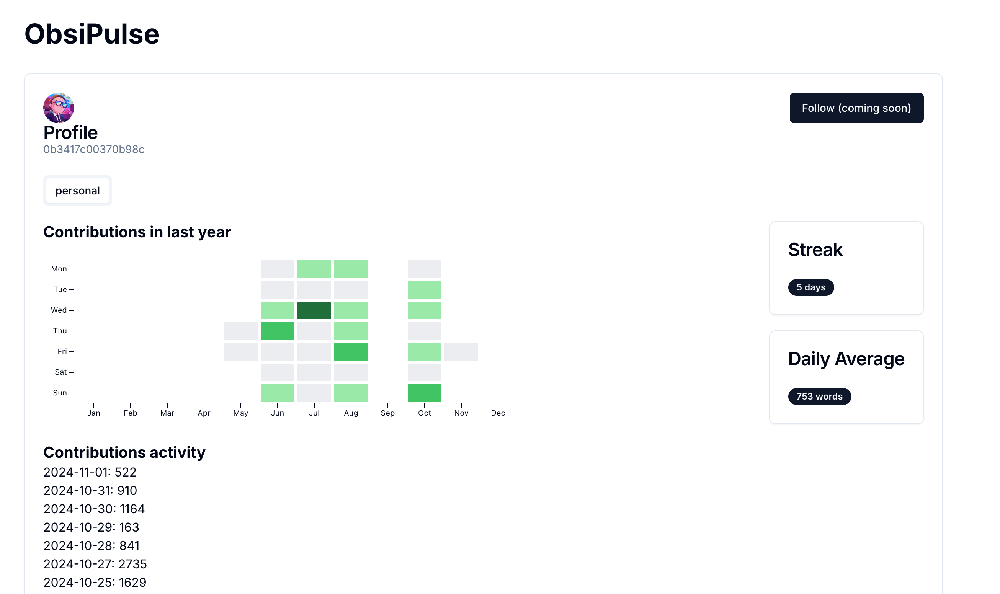

# ObsiPulse - Your Writing Activity Visualised

## Overview

ObsiPulse is a plugin for [Obsidian](https://obsidian.md) that allows users to track their daily word count across all notes in their vault. It provides a visual representation of your writing activity, similar to GitHub's contribution graph, and offers a public profile feature for sharing selected notes.
More details available on [Obsipulse.com](https://obsipulse.com).

## Features

- Gamify your writing by tracking your daily writing streak.
- Gain valuable insights into your writing habits.
- Share Your Progress with a free public profile URL to share your writing journey with friends or colleagues.
- Never answer the question "What Obsidian plugins do you use?" → it‘s all on your profile.
- Upload selected notes to your public ObsiPulse profile (with support of Dataview rendering).
- Seamlessly manage insights across multiple vaults.

## Usage

- Install the plguin from Obsidian's community plugins (or via BRAT).
- Write notes as you normally would.
- Run command `Open My ObsiPulse Public Profile` and your ObsiPulse public profile will open in your browser.

> Example of a public profile: [https://www.obsipulse.com/app/profile/0b3417c00370b98c](https://www.obsipulse.com/app/profile/0b3417c00370b98c)

## Configuration

### Settings

- **License Key**: Enter your license key to activate the plugin.
- **Files to be Published**: Specify the list of files to be shared publicly.

### Development Server

Run `yarn run dev` to start the development server

## Contributing

Contributions are welcome! Please open an issue or submit a pull request on GitHub.

## License

This project is licensed under the MIT License. See the [LICENSE](./LICENSE) file for details.

## Acknowledgments

- Developed by [@jsifalda](https://dub.sh/I5tFaqk)
- Inspired by lukeleppan's [Better Word Count](https://github.com/lukeleppan/better-word-count).

## Contact

- **Author**: Jiri Sifalda
- **GitHub**: [@jsifalda](https://github.com/jsifalda)

---

