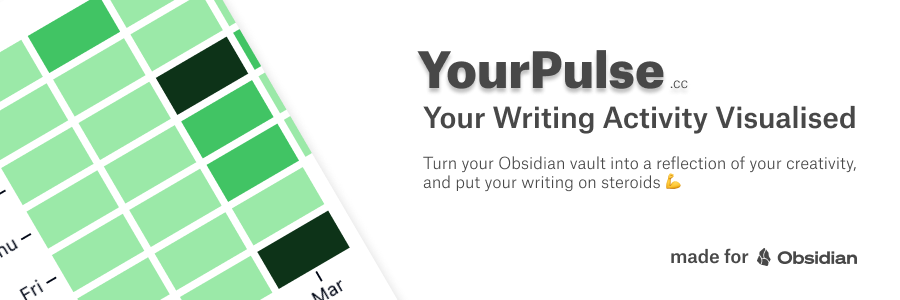

# YourPulse - Your Writing Activity Visualised

YourPulse (formerly <u>ObsiPulse</u>) is a plugin for [Obsidian](https://obsidian.md) that allows users to track their daily word count across all notes in their vault. It provides a visual representation of your writing activity, similar to GitHub's contribution graph, and offers a public profile feature for sharing selected notes.

Bundled with some additional features for complete creative writing workflow - **uploading and sharign notes in public**, and public profiles for your audience to discover you.

More details available on [YourPulse.cc](https://yourpulse.cc?ref=github).

## Features

- **Gamify your writing** by tracking your daily writing streak.
- **Gain valuable insights** into your writing habits.
- **Upload & share selected notes** (with support of **Dataview rendering**, and linked notes resolution).
- **Private Mode**: Activate with your license key to ensure no data leaves your vault - perfect for users who value their privacy.

### Sharing Notes Features
- **Always in sync**: YourPulse automatically detects changes in your notes and updates your public profile in real-time.
- **Dataview Rendering**: Supports rendering of Dataview queries within your notes, allowing you to share dynamic and interactive content.
- **Linked Notes Resolution**: Automatically resolves `![[note]]` references before upload, ensuring published content is complete - also with support of `![[note#section]]` and `![[note#^blockId]]`
- **HTML Comment Stripping**: Removes HTML comments from published content to exclude private notes within markdown files (`<!-- this part of the note will not be publsuhed -->`)
- **Total control over published content**: You can mark individual notes for publishing by adding `yp-publish: true` to their file properties (frontmatter) - plugin will automatically add `yp-publish-url: https://yourpulse.cc/app/profile/your-user-id/file/your-file-hash` property to the file after successful upload

### Public Profile Features

- **Compete with other Obsidian users** on a shared leaderboard.
- **Share Your Progress** with a free public profile URL to share your writing journey with friends or colleagues.
- Never answer the question **"What Obsidian plugins do you use?" → it's all on your profile.**
- Seamlessly manage insights across multiple vaults.

## Usage

- Install the plugin from Obsidian's community plugins
- Write notes as you normally would.
- Run `YourPulse` command and your YourPulse profile will open.

> Example of a public profile: [https://www.yourpulse.cc/app/profile/0b3417c00370b98c](https://www.yourpulse.cc/app/profile/0b3417c00370b98c)

## Configuration

### Settings

_(Optional)_

- **License Key**: Enter your license key to activate the plugin.
- **Files to be Published**: Specify the list of files to be shared publicly -> or you can also mark a note for publishing by adding `yp-publish: true` to its file properties (frontmatter).
- **Private Mode**: Activate with your license key to ensure no data leaves your vault - perfect for users who value their privacy.
- **Hide Status Bar**: Hide the status bar info.

### Development Server

Run `yarn run dev` to start the development server

## Contributing

Contributions are welcome! Please open an issue or submit a pull request on GitHub.

## Contact

- **Author**: Jiri Sifalda
- **X (Twitter)**: [@jsifalda](https://dub.sh/kWUczm4)
- **Bluesky**: [https://bsky.app/profile/jsifalda.bsky.social](https://dub.sh/OjV5UtC)
- **Author Web**: [https://craftengineer.com/](https://dub.sh/2aGWsiT)
- **Project Web**: [https://yourpulse.cc](https://dub.sh/RSzQwoG)

## FAQ

- **How secure is my data with YourPulse?**
  - We take your privacy seriously. No personal data from your vault is shared with us (it stays in your vault), plugin only collects your anonymised behavioural data points - such as the number of words written. (**If you are still concerned, you can activate Private Mode with your license key.**)
- **Will YourPulse work with multiple Obsidian vaults?**
  - Yes, YourPulse supports tracking across multiple vaults seamlessly.
- **Can I use YourPulse offline?**
  - Yes, all features work offline, with sync occurring when you're back online.
- **What network requests and why this plugin does?**
  - YourPulse Plugins makes API calls to store meta data of your writing activity and the list of plugins you use. Nothing else, no third party tracking or analysis. **We don't send your note content anywhere without your permission! (and when the Private Mode is enabled)**
- **What is Private Mode?**
  - Private Mode is a security feature that can be activated with your license key. When enabled, YourPulse operates completely offline - no data is sent outside your vault, ensuring maximum privacy for privacy-conscious users.

## License

This project is licensed under the MIT License. See the [LICENSE](./LICENSE) file for details.

## Acknowledgments

- Developed by [@jsifalda](https://dub.sh/I5tFaqk)
- Inspired by lukeleppan's [Better Word Count](https://github.com/lukeleppan/better-word-count).

## Support the Project

If you find this plugin valuable, consider supporting its development, because it helps me a lot!

---

